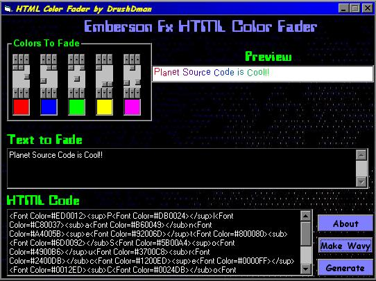



## HTML Color Fader

### Description

This lets you type in text then choose which colors to fade and push a button and makes your text colorful and faded.And it generates an HTML Code so that you can put it on your website.

Comes with MonkEFade.bas too!!
 
### More Info
 

             |
---                |---
**Submitted On**   |2001-06-09 12:14:22
**By**             |[Rush](https://github.com/Planet-Source-Code/PSCIndex/blob/master/ByAuthor/rush.md)
**Level**          |Beginner
**User Rating**    |5.0 (20 globes from 4 users)
**Compatibility**  |VB 6\.0
**Category**       |[Internet/ HTML](https://github.com/Planet-Source-Code/PSCIndex/blob/master/ByCategory/internet-html__1-34.md)
**World**          |[Visual Basic](https://github.com/Planet-Source-Code/PSCIndex/blob/master/ByWorld/visual-basic.md)
**Archive File**   |[HTML Color20892692001\.zip](https://github.com/Planet-Source-Code/rush-html-color-fader__1-23932/archive/master.zip)

